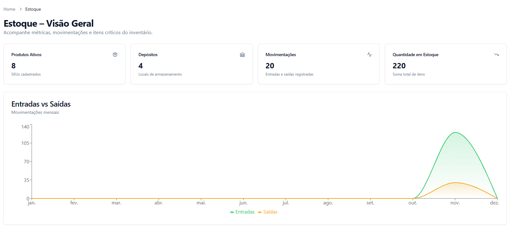
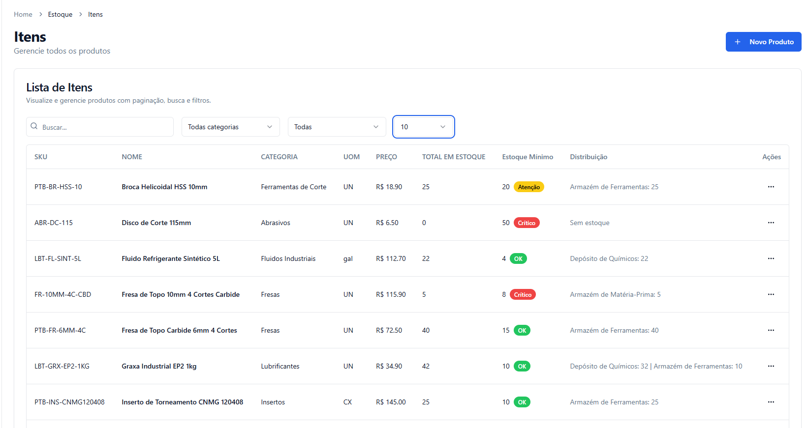
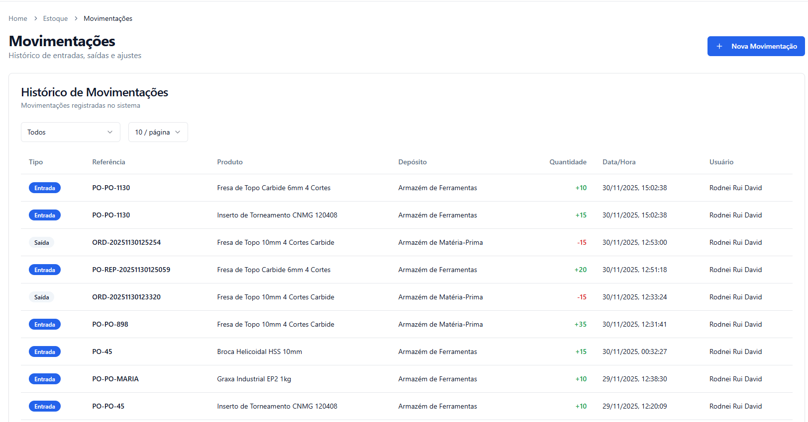

# RDTrackR - Sistema Gestão de Estoque Empresarial

## Índice

## Índice
- [Sobre o Projeto](#sobre-o-projeto)
- [Como Acessar o Sistema em Produção](#como-acessar-o-sistema-em-produção)
- [Usuário Demo para Testes](#usuário-demo-para-testes)
- [Funcionalidades Principais](#funcionalidades-principais)
- [Screenshots](#screenshots)
- [Arquitetura e Stack Tecnológica](#arquitetura-e-stack-tecnológica)
- [Modelagem (UML e C4)](#modelagem-uml-e-c4)
- [Requisitos Funcionais e Não Funcionais](#requisitos-funcionais-e-não-funcionais)
- [Segurança](#segurança)
- [Próximos Passos](#próximos-passos)
- [Documentação Completa](docs/rdtrackr-doc.md)
- [Autor](#autor)

## Sobre o Projeto

O **RDTrackR** é um sistema web profissional de gestão de estoque
voltado para empresas de usinagem, indústrias e operações logísticas.\
Ele oferece rastreabilidade completa, operações em tempo real, controle
multi-depósito, gestão de pedidos de compra, notificações automáticas e
um dashboard tático.

### Desenvolvido com:

-   **Backend:** .NET 8 (Clean Architecture + EF Core + SQL Server)
-   **Frontend:** React + TypeScript + Vite + Tailwind
-   **Notificações:** SignalR em tempo real
-   **Qualidade:** Testes automatizados + SonarCloud
-   **Ambiente:** Docker + GitHub Actions (CI/CD)

A solução reduz perdas, melhora rastreamento e aumenta eficiência
operacional.

------------------------------------------------------------------------

## Como Acessar o Sistema em Produção

A aplicação está disponível em ambiente cloud:\
**http://3.129.244.42:5173/**\
*(em breve: https://rdtrackr.com.br)*

------------------------------------------------------------------------

## Usuário Demo para Testes

Para facilitar a avaliação do sistema:

- **Usuário:** `usinagemrd2@hotmail.com`\
- **Senha:** `Demo@123`

Este usuário possui permissões completas e pode:

✔️ Criar produtos\
✔️ Registrar movimentações\
✔️ Criar pedidos de compra\
✔️ Ver notificações em tempo real\
✔️ Explorar dashboards

------------------------------------------------------------------------

## ✨ Funcionalidades Principais

### Gestão de Produtos

-   Cadastro completo (SKU, unidade, localização, categorias)
-   Controle de ativos/inativos
-   Estoque mínimo e ponto de reposição

### Movimentações de Estoque

-   Entradas e saídas
-   Depósito origem/destino
-   Auditoria automática
-   Atualizações em tempo real

### Multi-Depósito

-   Gerenciamento de almoxarifados\
-   Vínculo de produtos por localização\
-   Visão consolidada e detalhada

### Pedidos de Compra (PO)

-   Fluxo completo de criação, aprovação, itens e fornecedores\
-   Totais automáticos\
-   Histórico e acompanhamento

###  Dashboard Inteligente

-   Produtos ativos\
-   Movimentações recentes\
-   Itens críticos\
-   Total em estoque\
-   Comparações e evolução

### Notificações em Tempo Real

-   Implementado com SignalR\
-   Alertas de estoque baixo\
-   Movimentações instantâneas

### Autenticação e Segurança

-   JWT\
-   RBAC (perfís e permissões)

------------------------------------------------------------------------

## Algumas Funcionalidades

### Tela de Dashboard

A tela de Dashboard apresenta uma visão geral do sistema:

-   Resumo geral de estoque\
-   Itens com baixa disponibilidade\
-   Indicadores de movimentações\
-   Gráficos e estatísticas\

------------------------------------------------------------------------

### Cadastro de Produtos

Permite:

-   Inserção e edição de produtos\
-   Controle de SKU, nome e categorias\
-   Níveis mínimos\
-   Filtros avançados

------------------------------------------------------------------------

### Movimentações do Estoque

Inclui:

-   Entradas e saídas\
-   Filtros detalhados

------------------------------------------------------------------------

### Pedidos de Compra (PO)

Centraliza:

-   Criação de pedidos\
-   Quantidades, fornecedores\
-   Status\
-   Integração com movimentações

------------------------------------------------------------------------

## Arquitetura e Stack Tecnológica

### Padrões

-   Clean Architecture\
-   DDD Light\
-   Repository Pattern\
-   Event-driven com SignalR

### Stack

  Camada            Tecnologias
  ----------------- -------------------------------------------
  **Frontend**      React, TypeScript, Vite, Tailwind, ShadCN
  **Backend**       .NET 8 API, EF Core, FluentValidation
  **Banco**         SQL Server / PostgreSQL
  **Comunicação**   SignalR (WebSockets)
  **Infra**         Docker, Docker Compose, GitHub Actions
  **Qualidade**     Testes Automatizados + SonarCloud

------------------------------------------------------------------------

## Modelagem (UML e C4)

Diagramas de Caso de Uso e Modelagem C4 detalhados na documentação.

------------------------------------------------------------------------

## Considerações de Segurança

-   Uso obrigatório de **HTTPS**\
-   Tokens **JWT** com validade curta\
-   Controle por papéis (RBAC)\
-   Logs estruturados\
-   Policies CORS por ambiente\
-   Prevenção contra SQL Injection e XSS

------------------------------------------------------------------------

## Documentação Completa

Toda documentação está em:

[Documentação](docs/rdtrackr-doc.md)

Inclui:

Requisitos\
UML\
C4\
Arquitetura completa

------------------------------------------------------------------------

## Autor

**João Antonio David**\
Engenharia de Software -- Católica de Santa Catarina\
Orientador: Prof. Diogo Vinícius Winck
